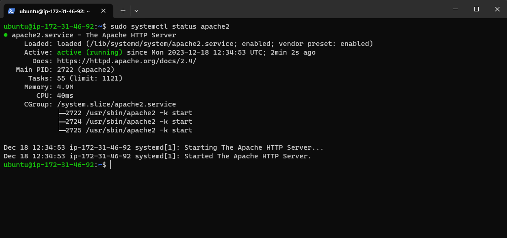

# Documentation of Project 1

## STEP 1 — INSTALLING APACHE AND UPDATING THE FIREWALL

### What exactly is Apache?

### Apache HTTP Server is the most widely used web server software. Developed and maintained by Apache Software Foundation, Apache is an open source software available for free. It runs on 67% of all webservers in the world. It is fast, reliable, and secure. It can be highly customized to meet the needs of many different environments by using extensions and modules.

### Most WordPress hosting providers use Apache as their web server software. However, websites and other applications can run on other web server software as well. Such as Nginx, Microsoft’s IIS, etc.

### The Apache web server is among the most popular web servers in the world. It’s well documented, has an active community of users, and has been in wide use for much of the history of the web, which makes it a great default choice for hosting a website.

### Install Apache using Ubuntu’s package manager ‘apt’:

`sudo apt update`

`sudo apt install apache2`

## To verify that apache2 is running as a Service in our OS, use following command

`sudo systemctl apache2`

### If it is green and running, then you did everything correctly – you have just launched your first Web Server in the Clouds!

### Before we can receive any traffic by our Web Server, we need to open TCP port 80 which is the default port that web browsers use to access web pages on the Internet

### As we know, we have TCP port 22 open by default on our EC2 machine to access it via SSH, so we need to add a rule to EC2 configuration to open inbound connection through port 80: Open inbound port 80

### Our server is running and we can access it locally and from the Internet (Source 0.0.0.0/0 means ‘from any IP address’).

### First, let us try to check how we can access it locally in our Ubuntu shell, run:

`curl http://localhost:80`  or you can use `curl http://127.0.0.1:80`

### These 2 commands above actually do pretty much the same – they use ‘curl’ command to request our Apache HTTP Server on port 80 (actually you can even try to not specify any port – it will work anyway). The difference is that: in the first case we try to access our server via DNS name and in the second one – by IP address (in this case IP address 127.0.0.1 corresponds to DNS name ‘localhost’ and the process of converting a DNS name to IP address is called "resolution"). We will touch DNS in further lectures and projects.

### As an output you can see some strangely formatted test, do not worry, we just made sure that our Apache web service responds to ‘curl’ command with some payload.

### Now it is time for us to test how our Apache HTTP server can respond to requests from the Internet. Open a web browser of your choice and try to access following url

`http://<Public-IP-Address>:80`   replace the <Public-IP-Address> with the public IPv4 from the ubuntu server

### Another way to retrieve your Public IP address, other than to check it in AWS Web console, is to use following command:

`curl -s http://169.254.169.254/latest/meta-data/public-ipv4`

### The URL in browser shall also work if you do not specify port number since all web browsers use port 80 by default.

### If you see following page, then your web server is now correctly installed and accessible through your firewall.

### Apache Ubuntu Default Page

### In fact, it is the same content that you previously got by ‘curl’ command, but represented in nice HTML formatting by your web browser.